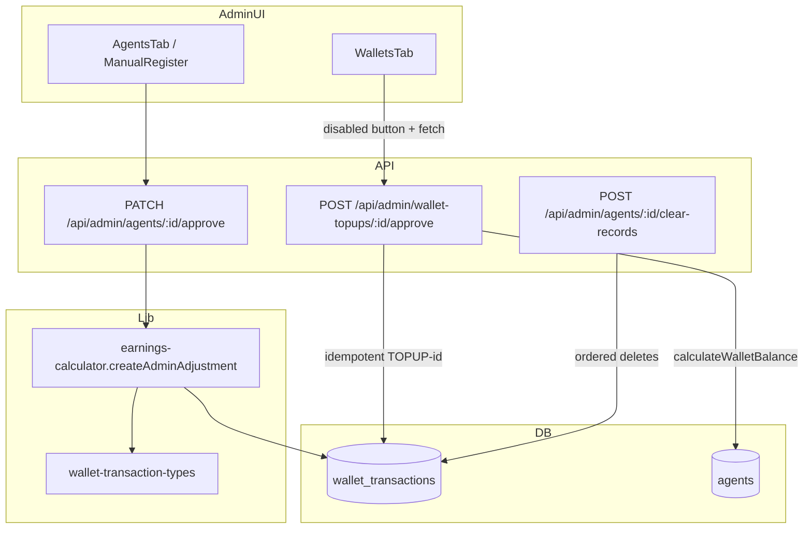

# Technical Issues and Fixes — Reference Guide

Permanent technical reference for maintainers of the DataFlex Ghana / Referral Powerhouse platform. Complements [`CHANGELOG.md`](./CHANGELOG.md).

---

## 1. Database constraint details

### 1.1 `wallet_transactions.transaction_type`

Production `wallet_transactions` has **no** `type` column. Only `transaction_type` is written.

**CHECK constraint** (`wallet_transactions_type_check`) allows exactly:

| Value | Effect on spendable wallet balance |
|-------|-----------------------------------|
| `topup` | Credit |
| `refund` | Credit |
| `admin_adjustment` | Credit |
| `deduction` | Debit |
| `withdrawal_deduction` | Debit |
| `admin_reversal` | Debit |
| `commission_deposit` | Tracked separately; **not** spendable wallet money |

Source of truth in code:

```typescript
// lib/wallet-transaction-types.ts
export const DB_TRANSACTION_TYPES = [
  "topup",
  "deduction",
  "refund",
  "commission_deposit",
  "withdrawal_deduction",
  "admin_reversal",
  "admin_adjustment",
] as const
```

**Invalid values that caused production failures:** `adjustment`, `debit`, `credit`, `admin_credit`, or any value passed via a legacy `type` column on insert.

### 1.2 `wallet_transactions.status`

Allowed: `pending`, `approved`, `rejected`.

Spendable balance calculations **must** filter `status = 'approved'`.

### 1.3 Agent status fields

Agents use boolean/feature flags rather than a single free-text status for core flows:

| Field | Meaning |
|-------|---------|
| `isapproved` | Platform access / approval |
| `isbanned` | Blocks approval and some actions |
| `deleted_at` | Soft delete (when column present) |
| `registration_source` | e.g. `manual_admin` |

Some deployments add a `status` column with a CHECK constraint (e.g. `active`, `pending`, `suspended`). **Problematic pattern:** RPC/trigger that set `status` to a value outside the CHECK when clearing or deleting related rows.

### 1.4 Problematic functions / triggers (historical)

| Object | Issue |
|--------|--------|
| Monolithic `clear_agent_*` SQL functions | FK order violations; invalid `status` updates |
| Triggers syncing `agents.wallet_balance` | Could fight app-level recalculation if types wrong |
| Client-side `wallet_transactions` insert via RLS | Failed or used wrong columns (`type`) |

**Current approach:** Application-level ordered deletes in `clear-records` route; balance sync via `calculateWalletBalance` after approved transactions.

### 1.5 Idempotency key for top-ups

```text
reference_code = 'TOPUP-' || wallet_topups.id
```

Unique index on `reference_code` (if present) prevents duplicate credits; API checks before insert.

---

## 2. Root cause analysis

### 2.1 Registrations / approvals failed (500)

**Symptom:** Manual registration with auto-approve or agent **Approve** returned 500; logs showed `wallet_transactions_type_check`.

**Root cause chain:**

1. Admin action calls `createAdminAdjustment` for ₵5 welcome credit.
2. Earlier code used helpers or wrong strings (`adjustment`, `admin_credit`) or sent a `type` column.
3. PostgreSQL rejected the insert; API returned 500 (or partial success with warning).

**Fix:** Hardcoded insert in `lib/earnings-calculator.ts`:

```typescript
await getDb().from("wallet_transactions").insert({
  agent_id: agentId,
  transaction_type: isCredit ? "admin_adjustment" : "admin_reversal",
  amount,
  status: "approved",
  description: `Admin ${isCredit ? "credit" : "debit"} adjustment - ${reason}`,
  reference_code: `ADJ-${isCredit ? "CR" : "DR"}-${Date.now().toString(36).toUpperCase()}`,
  admin_id: adminId,
  admin_notes: `${isCredit ? "Credit" : "Debit"} adjustment by admin. Reason: ${reason}`,
  created_at: new Date().toISOString(),
})
```

`createAdminReversal` uses `transaction_type: "admin_reversal"` only.

### 2.2 Clear records / delete failed

**Symptom:** Agent clear-records failed with FK or status constraint errors.

**Root cause:** Single RPC deleted child/parent tables in wrong order, or updated `agents.status` to a disallowed value.

**Fix:** `POST /api/admin/agents/[id]/clear-records` deletes in FK-safe order with `getAdminClient()`, then resets numeric counters on `agents` without removing the agent account.

### 2.3 Double wallet credits

**Symptom:** One approved top-up increased balance twice (e.g. ₵100 → ₵200).

**Root cause:**

1. Admin UI called Supabase directly with no in-flight guard.
2. Slow network → double click → two `insert` into `wallet_transactions`.
3. Auto-generated `reference_code` values differed per click, so DB uniqueness did not dedupe.

**Fix:**

- UI: `approvingTopupIds` disables Approve until `fetch` completes.
- API: `POST /api/admin/wallet-topups/[id]/approve` checks `reference_code = TOPUP-{id}` before insert.

### 2.4 Storefront Paystack → Vercel login

**Root cause:** `callback_url` built from `localhost` or deployment preview URL (`VERCEL_URL`), not the customer-facing storefront domain.

**Fix:** `NEXT_PUBLIC_STOREFRONT_ORIGIN` + hardcoded fallback `https://referralpowerhouse.vercel.app` in Paystack initialize/callback routes.

### 2.5 Storefront slug 404 / blank page

**Root cause:** `/store/[segment]` treated unknown slugs as invalid; case mismatch between QR link and DB.

**Fix:** `resolveStoreSegmentToAgentId` with normalization and fallback matching in `lib/storefront-server.ts`.

### 2.6 Jobs not found on dashboard

**Root cause:** Client attempted direct Supabase access to external jobs project without service role / wrong env.

**Fix:** Proxy through `/api/jobs` with `JOBS_SUPABASE_*` env vars server-side.

---

## 3. Solution architecture



### 3.1 Hardcoded transaction types

All admin wallet credits/debits go through `createAdminAdjustment` / `createAdminReversal` with literals matching `DB_TRANSACTION_TYPES`. Do not reintroduce `buildWalletTransactionInsertRow` for these two functions unless types remain literals inside the input.

### 3.2 Server-side record clearing

| Step | Tables |
|------|--------|
| 1 | `withdrawals` |
| 2 | `wallet_transactions`, `wallet_topups` |
| 3 | `commissions`, `commission_deposits`, `data_orders`, `wholesale_orders`, `referrals`, `project_chats`, `agent_sessions`, `pending_transactions` |
| 4 | Update `agents` balances to 0 |

Uses `getAdminClient()` only—never browser `supabase` anon key.

### 3.3 UI debounce + API idempotency

| Layer | Mechanism |
|-------|-----------|
| UI | `Set<string>` of top-up IDs currently approving; button `disabled` + label “Approving…” |
| API | `SELECT` existing row by `reference_code`; skip insert if found; handle `23505` unique violation |

### 3.4 Storefront URL stack

| Concern | Module |
|---------|--------|
| Paystack callback | `app/api/paystack/storefront/initialize/route.ts` |
| Payment verify + redirect | `app/api/paystack/storefront/callback/route.ts` |
| Order capture | `lib/storefront-order-capture.ts` |
| Customer URLs | `lib/storefront-utils.ts`, `lib/app-url.ts` |

---

## 4. Migration steps

### 4.1 SQL already run (typical production batch)

Run in Supabase SQL editor (exact script names may vary by environment):

1. **Wallet type constraint** — ensure CHECK matches the seven `transaction_type` values; drop legacy `type` column if it existed.
2. **Reference uniqueness** — unique index on `wallet_transactions.reference_code` where duplicates caused issues (recommended for idempotency).
3. **Agent clear audit** — `agent_clearing_audit` table for clear-records logging (optional).
4. **Security** — `REVOKE ALL ON <view_name> FROM anon, authenticated` for views exposing `auth.users`.
5. **Store profiles** — `agent_store_profiles.store_slug` indexed for lookup.

If a constraint still lists old values, align it:

```sql
ALTER TABLE wallet_transactions DROP CONSTRAINT IF EXISTS wallet_transactions_type_check;
ALTER TABLE wallet_transactions ADD CONSTRAINT wallet_transactions_type_check
  CHECK (transaction_type IN (
    'topup', 'deduction', 'refund', 'commission_deposit',
    'withdrawal_deduction', 'admin_reversal', 'admin_adjustment'
  ));
```

### 4.2 Environment variables

#### Core Supabase (required)

```env
NEXT_PUBLIC_SUPABASE_URL=
NEXT_PUBLIC_SUPABASE_ANON_KEY=
SUPABASE_SERVICE_ROLE_KEY=
```

#### Storefront / Paystack (required for live payments)

```env
NEXT_PUBLIC_STOREFRONT_ORIGIN=https://referralpowerhouse.vercel.app
PAYSTACK_SECRET_KEY=
NEXT_PUBLIC_PAYSTACK_PUBLIC_KEY=
```

#### Jobs board (required for dashboard jobs)

```env
NEXT_PUBLIC_JOBS_SUPABASE_URL=
JOBS_SUPABASE_SERVICE_ROLE_KEY=
# or NEXT_PUBLIC_JOBS_SUPABASE_ANON_KEY as fallback in lib/jobs-supabase-admin.ts
```

#### Site metadata (optional)

```env
NEXT_PUBLIC_SITE_URL=
NEXT_PUBLIC_APP_URL=          # Do not use localhost in production for agent-facing links
```

### 4.3 Deployment checklist

1. Set env vars on Vercel (Production).
2. Deploy branch with this changelog’s code.
3. Run `npm run build` locally or rely on CI.
4. Smoke-test checklist (section 5).

---

## 5. Testing checklist

### 5.1 Manual registration

- [ ] Admin → Manual Registration → create agent **without** auto-approve → agent `isapproved = false`, no wallet row required.
- [ ] Create agent **with** auto-approve → success; one `wallet_transactions` row with `transaction_type = admin_adjustment`, amount `5`, `status = approved`.
- [ ] No `wallet_transactions_type_check` in Supabase logs.

### 5.2 Agent approval

- [ ] Pending agent → Approve → `isapproved = true`.
- [ ] Exactly one welcome credit (`admin_adjustment`, ₵5) unless already approved (400).
- [ ] Banned agent cannot be approved.

### 5.3 Clear records

- [ ] Agent with orders, wallet tx, withdrawals → Clear records (confirm) → counts returned; balances zero; agent row still exists.
- [ ] Re-login as agent → wallet/commission displays zero.
- [ ] No FK violation in API logs.

### 5.4 Wallet top-up double-click

- [ ] Create pending top-up request.
- [ ] Click Approve rapidly twice → button disabled after first click.
- [ ] Only one `wallet_transactions` row with `reference_code = TOPUP-{uuid}`.
- [ ] Second approve (after refresh) returns idempotent success, balance unchanged.

### 5.5 Storefront Paystack

- [ ] Open live store `/store/{slug}`.
- [ ] Complete test Paystack payment (test keys).
- [ ] Redirect lands on `https://referralpowerhouse.vercel.app/store/{slug}?payment=success&ref=...` (not localhost, not Vercel SSO).
- [ ] Order appears in admin Storefront Manager; agent commission balance updates.

### 5.6 Storefront slug

- [ ] Referral Hub shows production URL (not `localhost:3000`).
- [ ] `/store/{store_slug}` loads bundles.
- [ ] `/store/{agent-uuid}` still works.
- [ ] Invalid slug → `not-available` or 404, not blank React tree.

### 5.7 Jobs

- [ ] Agent dashboard → jobs section loads without “not found”.
- [ ] `GET /api/jobs?active=true` returns JSON `{ jobs: [...] }`.
- [ ] Job detail page loads via `/api/jobs/{id}`.

### 5.8 Security / robots

- [ ] `GET /robots.txt` lists disallow rules for AI bots.
- [ ] Unauthenticated clients cannot select from hardened views (verify in Supabase).

---

## 6. Key file index

| Area | Path |
|------|------|
| Wallet types | `lib/wallet-transaction-types.ts` |
| Admin wallet mutations | `lib/earnings-calculator.ts` |
| Top-up approve API | `app/api/admin/wallet-topups/[id]/approve/route.ts` |
| Clear records | `app/api/admin/agents/[id]/clear-records/route.ts` |
| Agent approve | `app/api/admin/agents/[id]/approve/route.ts` |
| Manual register | `app/api/admin/agents/manual-register/route.ts` |
| Admin wallets UI | `components/admin/tabs/WalletsTab.tsx` |
| Storefront Paystack | `app/api/paystack/storefront/*` |
| Slug resolution | `lib/storefront-server.ts` |
| Public store page | `app/store/[segment]/page.tsx` |
| Jobs API | `app/api/jobs/route.ts`, `lib/jobs-api.ts` |
| Robots / AI | `app/robots.ts` |

---

## 7. Maintainer notes

1. **Never** add a `type` field to `wallet_transactions` inserts.
2. When adding a new `transaction_type`, migrate the DB CHECK **before** deploying code.
3. All admin wallet **writes** should use `getAdminClient()` or helpers that call it.
4. User-facing money actions (approve top-up, approve agent) need **idempotency** or UI guards.
5. Storefront URLs must use `NEXT_PUBLIC_STOREFRONT_ORIGIN` in production—never rely on preview deployment hostnames for Paystack callbacks.

---

*Last updated: May 2026 — finalisation pass with passing `npm run build`.*
